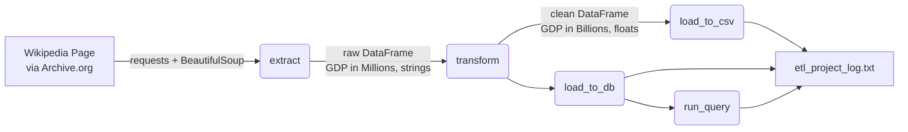

# 🌍 GDP ETL Pipeline — Extracting World Economies Data

A Python-based **ETL (Extract, Transform, Load)** pipeline that scrapes the list of countries by GDP (nominal, as reported by the IMF) from a Wikipedia snapshot, cleans and converts the data, and loads it into both a CSV file and a SQLite database — with full process logging.

This project was built as a hands-on exercise to actually understand **how web scraping + data pipelines work end-to-end**, not just copy-paste code. Every function below is broken down with the *why*, not just the *what*.

---

## 📌 Why this project?

Imagine you're a junior Data Engineer at a firm that wants to expand internationally. Your job: build a script that automatically pulls the latest GDP rankings from the web, cleans it up, and stores it somewhere the rest of the team (or other systems) can query — twice a year, whenever the IMF updates its numbers, without touching the code again.

That's exactly what this script does.

---

## 🗺️ Learning Map

If you're new to web scraping / ETL, here's the order these concepts build on each other:

```
1. HTTP requests        → How to "download" a webpage as raw text
2. HTML parsing          → Turning that messy text into a searchable structure
3. Locating data in HTML → Finding the right table among many on a page
4. Data extraction       → Pulling specific values out of table rows
5. Data cleaning         → Removing commas, converting strings to numbers
6. Unit conversion       → Million USD → Billion USD, rounded
7. Persisting data       → Saving to CSV (file) and SQLite (database)
8. Querying data         → Using SQL to filter results
9. Logging               → Recording what the script did, and when
10. Orchestration        → Calling everything in the right order
```

Each numbered concept below maps directly to a function in `etl_project_gdp.py`.

---

## 🏗️ Pipeline Overview



---

## 🧩 Step-by-Step Breakdown

### 1. Extract — pulling the raw table off the web

The target page has **multiple tables** (the actual GDP table is the 3rd one — index `2`). Two tricky filtering rules were needed:

- The `"World"` row (the global total) doesn't have a hyperlink on its country name, while every real country does — so we use that to skip it.
- Some countries show `—` (an em dash, not a regular hyphen) instead of a GDP number, when IMF hasn't reported a value — those rows are skipped too.

```python
def extract(url, table_attribs):
    ''' Extracts required info from website, returns dataframe '''
    page = requests.get(url).text
    data = BeautifulSoup(page, 'html.parser')
    df = pd.DataFrame(columns=table_attribs)
    tables = data.find_all('tbody')
    rows = tables[2].find_all('tr')

    for row in rows:
        col = row.find_all('td')
        if len(col) != 0:
            if col[0].find('a') is not None and '—' not in col[2]:
                data_dict = {"Country": col[0].a.contents[0],
                             "GDP_USD_millions": col[2].contents[0]}
                df1 = pd.DataFrame(data_dict, index=[0])
                df = pd.concat([df, df1], ignore_index=True)
    return df
```

**Key idea:** `requests` fetches the raw HTML as text, `BeautifulSoup` turns that text into a navigable tree so we can search by tag (`<tbody>`, `<tr>`, `<td>`) instead of doing fragile string matching.

---

### 2. Transform — cleaning and converting the numbers

Raw scraped GDP values look like `"26,854,599"` — a string, with commas, in millions. Two things need to happen:

```python
def transform(df):
    ''' Converts GDP from Million USD to Billion USD, rounds to 2 decimals '''
    GDP_list = df["GDP_USD_millions"].tolist()
    GDP_list = [float("".join(x.split(','))) for x in GDP_list]
    GDP_list = [np.round(x / 1000, 2) for x in GDP_list]
    df["GDP_USD_millions"] = GDP_list
    df = df.rename(columns={"GDP_USD_millions": "GDP_USD_billions"})
    return df
```

**Key idea:** Strip the commas → convert to `float` → divide by 1000 to go from Millions to Billions → round to 2 decimal places → rename the column to reflect the new unit. This is the "clean up messy real-world data" step every data pipeline has.

---

### 3. Load — saving the clean data

Two destinations, same clean DataFrame:

```python
def load_to_csv(df, csv_path):
    ''' Saves dataframe as CSV file '''
    df.to_csv(csv_path)

def load_to_db(df, sql_connection, table_name):
    ''' Saves dataframe as database table '''
    df.to_sql(table_name, sql_connection, if_exists='replace', index=False)
```

**Key idea:** `to_csv()` is a flat-file snapshot anyone can open in Excel. `to_sql()` stores the same data as a proper database table — 
which means it can now be **queried** with SQL, joined with other tables, filtered, etc.

---

### 4. Query — proving the data is actually usable

```python
def run_query(query_statement, sql_connection):
    ''' Runs the query statement, prints output '''
    print(query_statement)
    query_output = pd.read_sql(query_statement, sql_connection)
    print(query_output)
```

Called with:

```python
query_statement = f"SELECT * from {table_name} WHERE GDP_USD_billions >= 100"
run_query(query_statement, sql_connection)
```

**Key idea:** Once data is in a database, filtering it is a one-liner in SQL — no manual looping through rows needed.

---

### 5. Logging — tracking what the script did

```python
def log_progress(message):
    ''' Logs the mentioned message with a timestamp '''
    timestamp_format = '%Y-%h-%d-%H:%M:%S'
    now = datetime.datetime.now()
    timestamp = now.strftime(timestamp_format)
    with open("etl_project_log.txt", "a") as f:
        f.write(timestamp + ' : ' + message + '\n')
```

**Key idea:** `"a"` mode *appends* to the log file instead of overwriting it, so every run of the script adds new lines instead of erasing history — useful for auditing when this script runs unattended (e.g., on a schedule).

---

### 6. Orchestration — running it all in order

```python
log_progress('Preliminaries complete. Initiating ETL process')

df = extract(url, table_attribs)
log_progress('Data extraction complete. Initiating Transformation process')

df = transform(df)
log_progress('Data transformation complete. Initiating loading process')

load_to_csv(df, csv_path)
log_progress('Data saved to CSV file')

sql_connection = sqlite3.connect(db_name)
log_progress('SQL Connection initiated')

load_to_db(df, sql_connection, table_name)
log_progress('Data loaded to Database as table. Running the query')

query_statement = f"SELECT * from {table_name} WHERE GDP_USD_billions >= 100"
run_query(query_statement, sql_connection)

log_progress('Process Complete')
sql_connection.close()
```

This is the "glue" — it doesn't live inside any function, it just calls each function in the correct sequence and logs progress along the way.

---

## ⚠️ A bug I actually hit (and how I fixed it)

While building the logging function, I got:

```
AttributeError: type object 'datetime.datetime' has no attribute 'datetime'
```

**Cause:** I had imported `from datetime import datetime`, which makes `datetime` refer directly to the *class*, not the module. So calling `datetime.datetime.now()` breaks, since there's no `.datetime` attribute inside the class itself.

**Fix:** Changed the import to `import datetime` (the module), so `datetime.datetime.now()` correctly refers to `module.class.method()`.

Small mistake, but it's exactly the kind of thing that trips up beginners with Python's `datetime` — leaving it here for anyone who hits the same error.

---

## 🛠️ Tech Stack

| Library | Purpose |
|---|---|
| `requests` | Fetch the raw HTML of the webpage |
| `beautifulsoup4` | Parse and search through the HTML |
| `pandas` | Store, clean, and manipulate tabular data |
| `numpy` | Rounding GDP values to 2 decimal places |
| `sqlite3` | Store data in a local SQL database |
| `datetime` | Generate timestamps for logging |

---

## ▶️ How to Run

```bash
pip install pandas bs4 numpy
python etl_project_gdp.py
```

**Outputs generated:**
- `Countries_by_GDP.csv` — full list of countries and their GDP (in Billion USD)
- `World_Economies.db` — SQLite database with a `Countries_by_GDP` table
- `etl_project_log.txt` — timestamped log of every pipeline stage

---

## 📊 Sample Output

```
SELECT * from Countries_by_GDP WHERE GDP_USD_billions >= 100
             Country  GDP_USD_billions
0      United States          26854.60
1              China          19373.59
2              Japan           4409.74
3            Germany           4308.85
4              India           3736.88
..               ...               ...
64             Kenya            118.13
65            Angola            117.88
66              Oman            104.90
67         Guatemala            102.31
68          Bulgaria            100.64

[69 rows x 2 columns]
```

---

## 📁 Project Structure

```
├── etl_project_gdp.py       # Main ETL script
├── Countries_by_GDP.csv     # Output: cleaned data as CSV
├── World_Economies.db       # Output: SQLite database
├── etl_project_log.txt      # Output: execution log
└── README.md
```

---

## 🚀 What I Learned

- How to scrape a specific table out of a page that has multiple tables
- Why raw web data (currency strings, missing values) always needs a transform step before it's usable
- The difference between saving data to a flat file (CSV) vs. a queryable database (SQLite)
- Writing a basic logging function from scratch, and a real debugging lesson on Python's `datetime` import behavior
- Structuring a script into small, single-responsibility functions instead of one long block of code

## 🔭 Possible Improvements

- Add error handling for when the source URL is unreachable (fallback to live Wikipedia URL)
- Schedule the script to run automatically (e.g., via `cron` or a task scheduler) since IMF updates this data twice a year
- Add unit tests for the `transform()` function
- Extend to also capture World Bank / UN GDP estimates for comparison

---

## 👤 Author

Built as a self-learning project to understand web scraping and ETL pipelines end-to-end, step by step.
